# Architecture UML + C4 Diagrams

Source architecture document: `doc/Architecture.md`

## 14. Code-Verified UML / Mermaid Views

This section translates the implemented v1 architecture into executable Mermaid diagrams.  
Companion sections: §1–§13 in this document and `doc/specification.md`.

> Verification note: keep these diagrams synchronized with actual source under:
> - `src/app/core` (interfaces/tokens)
> - `src/app/adapters` (native/fallback fs, markdown, backup, telemetry)
> - `src/app/features` (file-tree/editor/preview/toolbar/dialogs)
> - `src/app/state` (workspace/open-file state)
> - `e2e/` and unit/integration tests
> - `ngsw-config.json`, service-worker registration code, `.github/workflows/ci.yml`

### 14.1 Layered Component Diagram

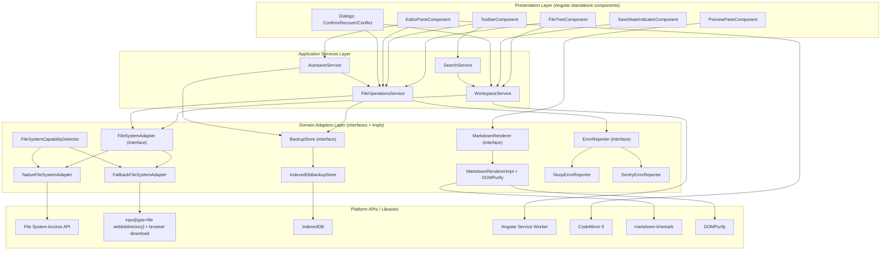

### 14.2 Class Diagram (Contracts + Implementations)

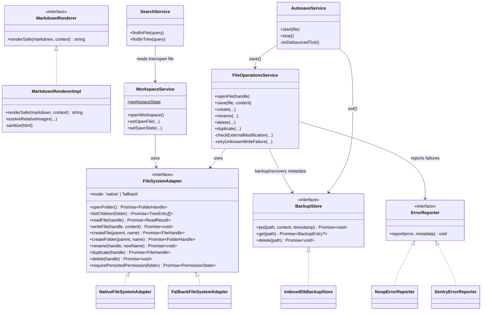

### 14.3 Sequence Diagram — Open → Edit → Autosave → Backup

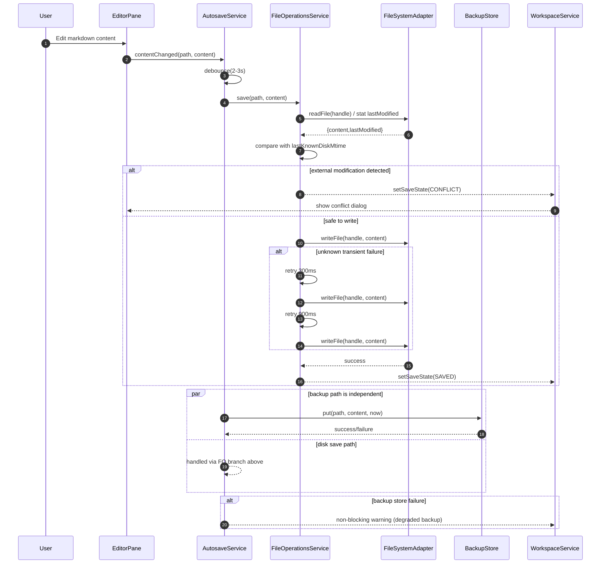

### 14.4 Sequence Diagram — Recovery Prompt on File Open

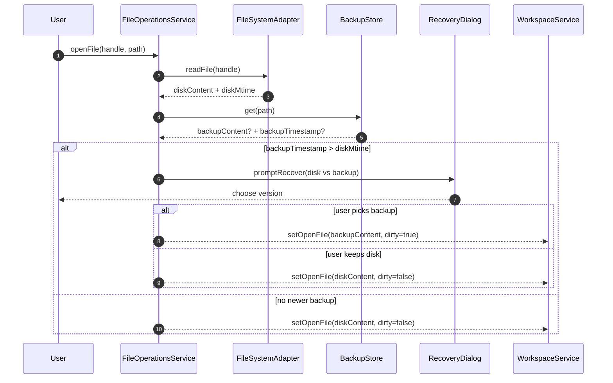

### 14.5 State Diagram — Open File Lifecycle

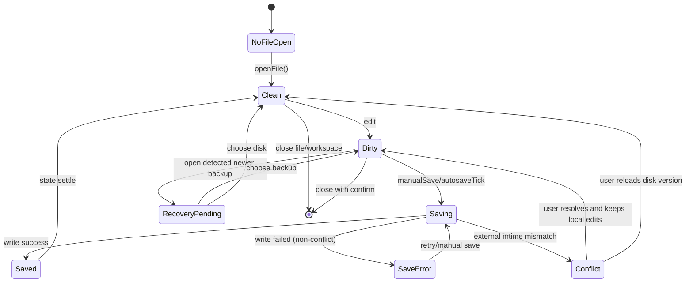

### 14.6 Deployment / Runtime Diagram (Browser-only v1)

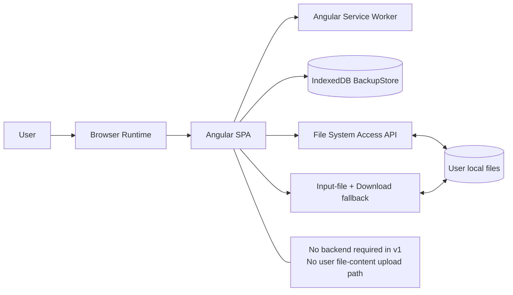

### 14.7 Diagram-to-Code Mapping (fill/verify during maintenance)

| Diagram element | Expected implementation area |
|---|---|
| `FileSystemAdapter` + impls | `src/app/core/*` + `src/app/adapters/filesystem/*` |
| `MarkdownRenderer` pipeline | `src/app/adapters/markdown/*` |
| `BackupStore` (IndexedDB) | `src/app/adapters/backup/*` |
| `ErrorReporter` no-op/Sentry seam | `src/app/adapters/telemetry/*` |
| `WorkspaceService`, `FileOperationsService`, `AutosaveService`, `SearchService` | `src/app/**/**.service.ts` |
| File tree/editor/preview/dialog interactions | `src/app/features/*` |
| Recovery/conflict/autosave behavior assertions | unit/integration tests + `e2e/*` |
| SW/offline shell caching | `ngsw-config.json` + app bootstrap SW registration |
| CI gates (`build`, `vitest`, `playwright`, audit/budgets if enabled) | `.github/workflows/ci.yml` |

### 14.8 What is required to keep these diagrams trustworthy

1. **Single source of truth rule**: if service/adapter contracts change, update §14 in same PR.
2. **Traceability check in PR template**: “Architecture/UML touched? yes/no”.
3. **Test evidence links**: every sequence diagram should be backed by at least one test suite (unit/integration/e2e).
4. **Doc drift gate**: lightweight CI script can grep for key interfaces/services and fail if missing from diagram mapping table.
5. **Version tag**: add a short line under §14 title: “Last verified against commit `<sha>`”.

## 15. C4-Style Mermaid Views (v1)

This section provides a C4-style architecture view of the Markdown & Text File Editor using Mermaid.
Scope is v1 as defined in this document and `doc/specification.md`.

### 15.1 System Context (C4 Level 1)

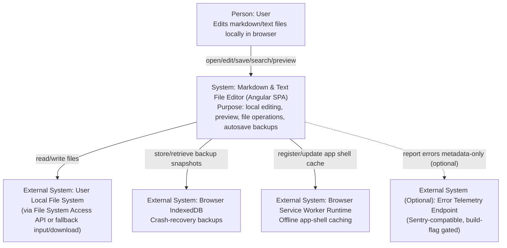

### 15.2 Container View (C4 Level 2)

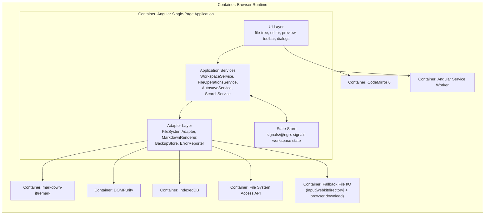

### 15.3 Component View — Angular SPA (C4 Level 3)

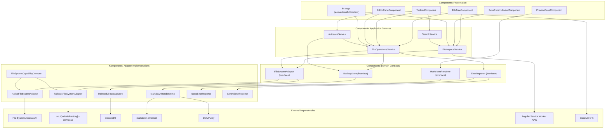

### 15.4 Dynamic View — “Open → Edit → Autosave” (C4 Level 4-style runtime flow)

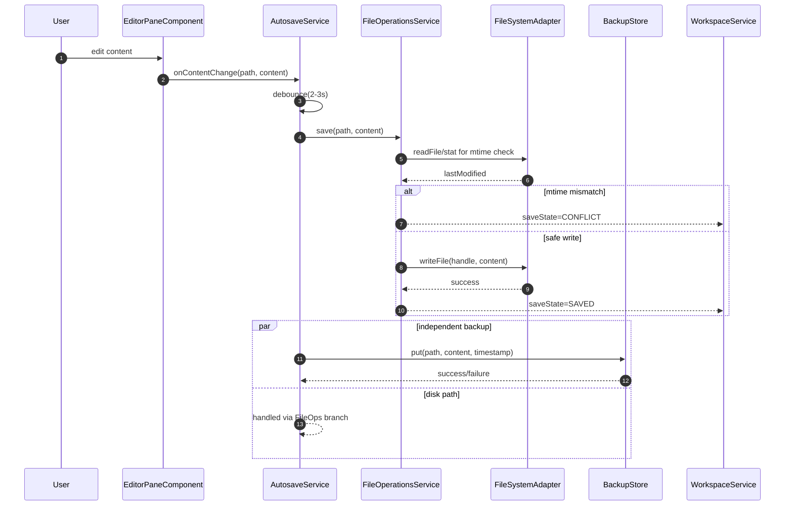

### 15.5 Deployment View (C4 Deployment-style simplified)

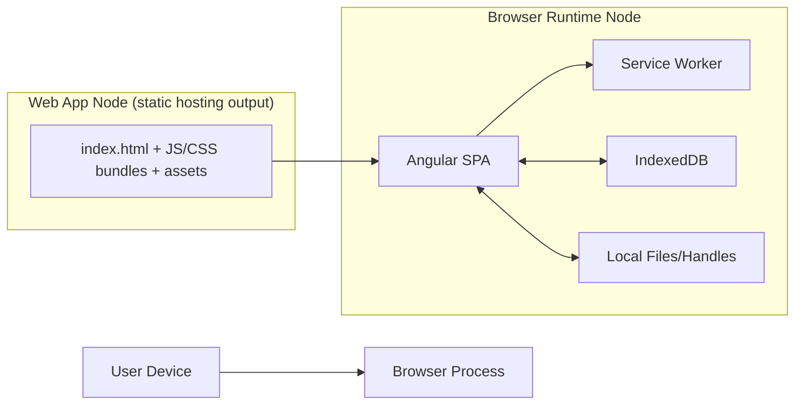

### 15.6 C4 Diagram Maintenance Checklist

- Update these diagrams whenever contracts in `src/app/core` change.
- If any service ownership changes (`FileOperationsService`, `AutosaveService`, etc.), update 15.3 + 15.4 in same PR.
- Keep fallback/native behavior explicit in diagrams whenever `FileSystemAdapter` behavior changes.
- Keep telemetry optional path dotted unless it becomes mandatory.
- Record verification commit SHA below after each update.

**Last verified against commit:** `9299fe34336cd1537942f90478cb2ba821709966`
